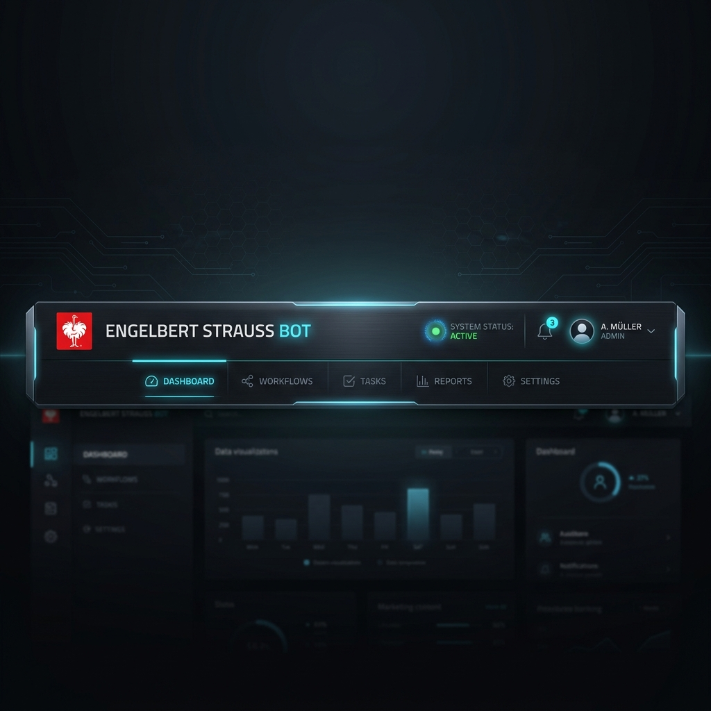
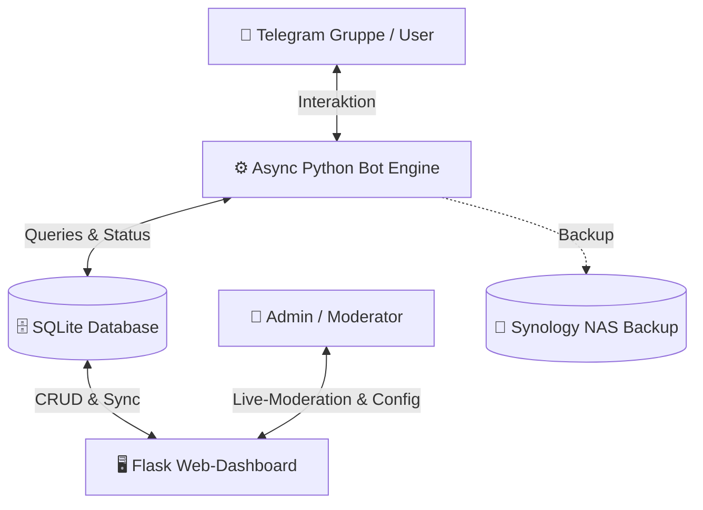
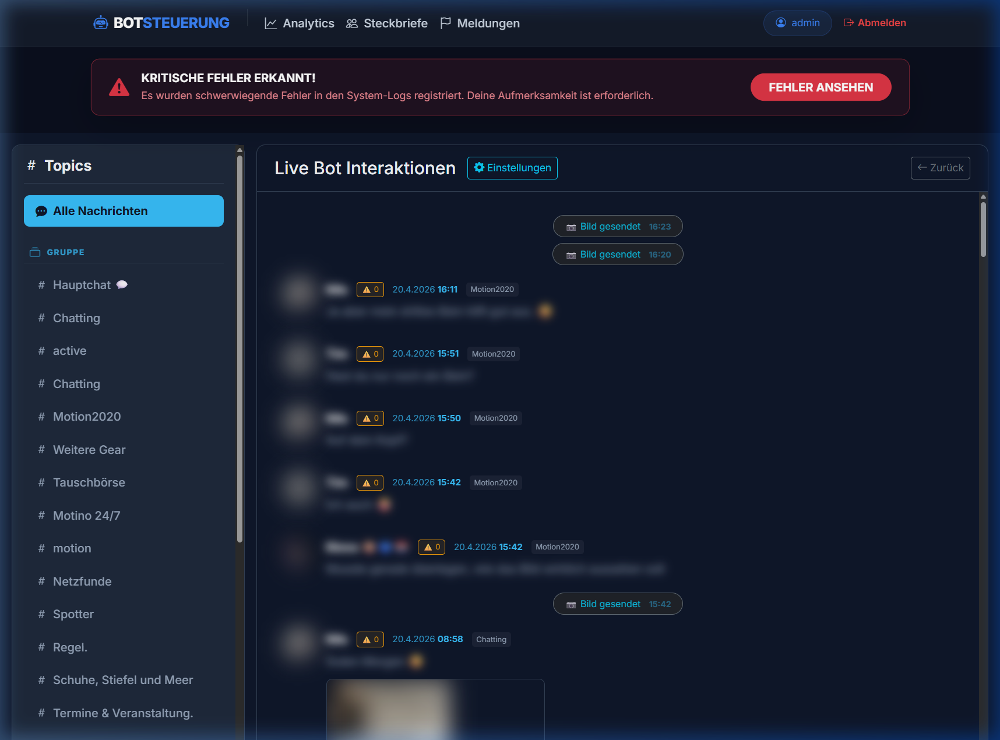
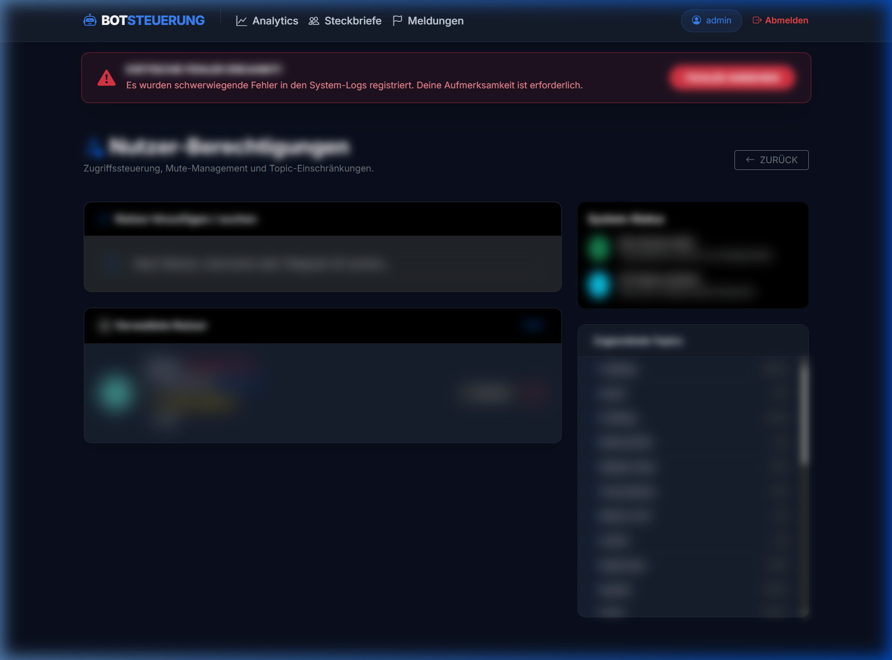
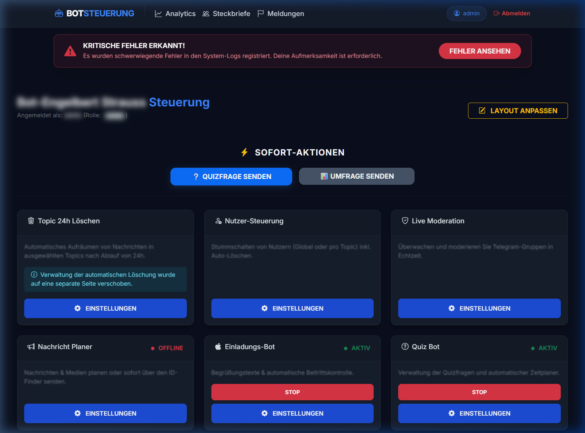

# 🤖 Engelbert Strauss Bot Suite & Dashboard — v2.9.5 [Stable]

[](https://www.python.org/)
[](https://flask.palletsprojects.com/)
[](https://www.sqlite.org/)
[](https://www.docker.com/)
[](https://www.synology.com/)
[](LICENSE.md)

Dieses Projekt ist eine vollumfängliche, hochmoderne **Community-Management-Lösung** für Telegram-Gruppen, gesteuert über ein elegantes, reaktives **Web-Dashboard** im modernen **Glassmorphism-Stil**. Die Suite verbindet eine hochperformante, asynchrone Python-Bot-Engine für Telegram mit einer zentralen Administrationsoberfläche, um große Communities effizient zu moderieren, Events zu planen und Nutzerinteraktionen in Echtzeit zu verfolgen.

---

## 🌟 Die Vision & Das Ökosystem

Der **Engelbert Strauss Bot** ist kein einfacher Chatbot, sondern ein modulares Ökosystem für Administratoren und Moderatoren. 

Durch das nahtlose Zusammenspiel von **asynchronen Bot-Modulen** und dem **Flask-basierten Web-Dashboard** können Chats strukturiert, Interaktionen visualisiert und administrative Routineaufgaben vollständig automatisiert werden. Entwickelt für hohe Skalierbarkeit, Ausfallsicherheit (Docker-optimiert für Synology NAS) und maximale Benutzerfreundlichkeit.



---

## 🚀 Die Bot-Flotte: Kern-Features (Telegram-Module)

Die Bot-Engine besteht aus einer Reihe spezialisierter Module, die flexibel aktiviert und über das Dashboard konfiguriert werden können:

### 📅 Event Planer Pro
Das Flaggschiff-Modul zur nahtlosen Event-Organisation direkt im Gruppenchat:
* **Interaktive Buttons**: User melden sich direkt in der Gruppe an ("Dabei", "Vielleicht", "Absagen").
* **Automatisierte Privatnachrichten**: Bei Zusage erhält der Nutzer sofort eine Bestätigung mit individuellen Event-Details.
* **Dynamische Kalender-Generierung**: On-the-fly Erstellung von `.ics`-Kalenderdateien zum direkten Import in iOS (Apple Kalender), Android (Google Kalender) und Outlook.
* **Geocoding & Location Search**: Intelligente Ortsauflösung mittels OpenStreetMap (Nominatim API) zur Bereitstellung präziser Event-Koordinaten.
* **Dashboard-Tracking**: Echtzeit-Visualisierung aller RSVPs und Zusagen im Admin-Panel.

### 👤 Einladungs- & Gatekeeper-System (Invite Bot)
Schützt die Community vor Spam-Bots und organisiert den Beitritts-Workflow:
* **Whitelist-Prüfung**: Kontrollierter Zugang nur für zugelassene Kontakte.
* **Custom Profile Fields (z.B. Puppy-Alter)**: Abfrage individueller Nutzerdaten beim Erstbeitritt zur optimalen Community-Segmentierung.
* **Skip-Button Logik**: Optionale Abfrageschritte können vom Nutzer übersprungen werden.
* **Echtzeit-Admin-Entscheidung**: Direkte Freischaltungs-Links für Administratoren bei neuen Beitrittsanfragen.

### 🔍 Steckbrief & ID-Finder Bot
Die integrierte Nutzerdatenbank zur einfachen Identifikation und Verwaltung:
* **Profil-Registrierung**: Nutzer erstellen strukturierte Steckbriefe inklusive Fotos/Medien.
* **ID-Finder Cockpit**: Blitzschnelle Suche nach Telegram-IDs, Usernames oder Profilmerkmalen.
* **Freigabe-Workflow**: Administratoren prüfen und aktivieren eingereichte Steckbriefe mit einem Klick.

### 👑 Outfit Contest & Gamification
Steigert das Engagement in der Gruppe durch spielerische Elemente:
* **Tägliche Wettbewerbe**: Automatisches Posten und Einsenden von Community-Outfits.
* **Interaktive Votings**: Gruppenmitglieder stimmen direkt über Buttons ab.
* **Automatisierte Badges**: Gewinner erhalten exklusive Profil-Abzeichen im System.

### 💬 Auto-Responder & Custom Commands
* **Keyword-Trigger**: Automatisierte Antworten auf häufig gestellte Fragen (FAQs) im Gruppenchat.
* **Custom Slash-Commands**: Eigene `/befehle` können direkt über das Web-Dashboard angelegt, geändert und mit individuellen Bot-Antworten hinterlegt werden, ohne dass Code geändert werden muss.

### 🛡️ Moderation & Sicherheit
* **KI-Profanity Filter**: Intelligenter Schutz vor Beleidigungen und Spam über eine konfigurierbare Blacklist.
* **Zeitgesteuerter Cleanup Manager**: Präzise, zeitverzögerte Löschung von Bot-Nachrichten, um den Chat sauber und übersichtlich zu halten.
* **Report-System (`/report`)**: Nutzer können Regelverstöße anonym an das Admin-Team melden. Die Meldungen werden sofort im Dashboard protokolliert.
* **Global & Topic Mute**: Temporärer oder dauerhafter Entzug der Schreibrechte für bestimmte Nutzer, entweder global oder spezifisch für einzelne Topics.

### 🎁 Weitere Module
* **Geburtstags-Bot**: Verwaltet Geburtstagslisten und sendet automatisch geplante Gratulationen.
* **Minecraft Status**: Echtzeit-Überwachung und Statusanzeige von verknüpften Minecraft-Servern im Dashboard.
* **Quiz & Umfragen**: Interaktive Module zur schnellen Durchführung von Abstimmungen und Wissensspielen.

---

## 🖥️ Premium Web-Dashboard (Das Cockpit)

Das Dashboard wurde auf Version **v3.0.0 (Premium Upgrade)** redesigned. Es setzt auf ein responsives **Glassmorphism-Design** mit einer einklappbaren Seitenleiste (Sidebar) für eine übersichtliche Strukturierung der über 24 administrativen Module.

```
📁 BOT STEUERUNG (Dashboard-Navigation)
│
├── 🏠 Übersicht (Zentrales Cockpit mit Live-System-Telemetry & Widgets)
│
├── 🛡️ Moderation & Sicherheit
│   ├── 📺 Live Moderation (Echtzeit-Chatverlauf mit 1:1 Mirroring)
│   ├── 🚫 Nutzer-Sperren (Globale & Topic-spezifische Stummschaltungen)
│   ├── 🤬 Beleidigungsfilter (Dynamische Schimpfwort-Blacklist)
│   └── 🚩 Melde-System (Eingegangene /report Logs)
│
├── 🤖 Bot Module
│   ├── 🍏 Einladungs-Bot (Whitelist, Freigaben & Puppy-Age Config)
│   ├── 🔎 ID-Finder Bot (Steckbrief-Prozess & Master-Datenbank)
│   ├── 👑 Outfit-Contest (Wettbewerbssteuerung & Badges)
│   ├── 💬 Auto-Responder (Verwaltung von Custom Commands & Keywords)
│   ├── 🎁 Geburtstags-Bot (Eintragungen & Gratulations-Scheduler)
│   ├── 📅 Event Planer (RSVPs, Termine & OpenStreetMap)
│   └── ❓ Quiz & Umfragen (Fragenkataloge & Zeitpläne)
│
├── 📊 Statistiken & Logs
│   ├── 👥 Steckbrief-Katalog (Visuelle Galerie aller fertigen Nutzerprofile)
│   ├── 📈 Analytics (Nutzeraktivität, Beitrittsstatistiken & Trends)
│   └── ⛏️ Minecraft-Status (Infrastruktur-Überwachung)
│
└── ⚙️ System-Verwaltung
    ├── 👥 Team-Verwaltung (Rollenbasierter Zugriff für Admins/Moderatoren)
    ├── 💾 Backup & Recovery (Synology NAS Anbindung & ZIP-Exporte)
    └── 🔄 Software-Update (Echtzeit GitHub Sync, Log-Viewer & Updater)
```

### Die Dashboard-Highlights:

#### 1. Live Moderation Control Center (1:1 Chat Mirroring)
* **Echtzeit-Interaktionsspiegelung**: Zeigt eingehende Nachrichten, Callback-Queries und Button-Klicks der User in Echtzeit an.
* **Intelligente Chat-Kategorisierung**: Automatische Filterung nach Hauptchat, Admin-Bereichen und privaten Nutzer-Steckbriefen.
* **Manueller Support-Modus (Bot-Pause)**: Administratoren können die automatisierten Antworten des Bots für einen bestimmten Nutzer temporär pausieren, um manuell zu chatten. Automatischer Resume nach 4 Stunden oder maximal 24 Stunden.
* **Zustellungs-Feedback**: Echtzeit-Verifizierung, ob Nachrichten zugestellt wurden. Schlägt die Zustellung fehl (z. B. weil der User den Bot blockiert hat), wird dies im Dashboard sofort rot markiert.
* **Context-Messaging**: Erkennt automatisch den Kontext (z. B. ob die Antwort in ein spezifisches Gruppentopic oder als private Nachricht an den Nutzer gesendet werden muss).

#### 2. Role-Based Access Control (RBAC) 🛡️ *(Neu in v2.9.5)*
* Klare Trennung zwischen **Administratoren** und **Moderatoren**.
* Moderatoren erhalten ausschließlich Zugriff auf betriebliche Module (Live-Moderation, ID-Finder, Custom Commands).
* Sensible Systembereiche wie System-Updates, kritische Log-Dateien, Minecraft-Status, Geburtstags-Einstellungen und Backups werden für Moderatoren ausgeblendet und sind serverseitig über `@admin_required` geschützt.

#### 3. Automatische Schema-Heilung (Self-Healing DB) ⚙️ *(Neu in v2.9.5)*
* Das System überprüft beim Start vollautomatisch die SQLite-Struktur.
* Fehlende Spalten (z. B. durch Upgrades hinzugefügte Attribute wie Rollenberechtigungen) werden im Hintergrund ohne Datenverlust per `ALTER TABLE` injiziert.
* **Keine manuellen Migrationsskripte oder SQL-Befehle notwendig!**

---

## 📷 Visual Tour

Das Dashboard überzeugt durch eine moderne, konsistente Oberfläche:

| Live Moderation | Steckbrief-Katalog (User Registry) | System Dashboard (Home) |
| :---: | :---: | :---: |
|  |  |  |

*Das Gesamtlayout nutzt transluzente Glaskarten (Glassmorphism), ein tiefdunkles Farbschema mit kontrastierenden Akzentfarben sowie flüssige CSS-Übergänge für eine erstklassige Benutzererfahrung.*

---

## 🛠 Technik-Stack

* **Backend-Engine**: Python 3.10+ (Asynchrone `python-telegram-bot` Bibliothek)
* **Web-Framework**: Flask & Jinja2 Templates (Modularisiert via Flask Blueprints)
* **Styling**: Modernes Vanilla CSS3 (Custom HSL Palette, Variable-based Glassmorphism)
* **Frontend-Logik**: Modern Javascript (ES6, Fetch API, Server-Sent Events für Echtzeit-Sync)
* **Datenbank**: SQLite mit SQLAlchemy ORM (Self-Healing Schema-Migrationen)
* **Deployment**: Docker & Docker-Compose (Optimiert für Synology NAS-Umgebungen)
* **Geolocating**: Nominatim OpenStreetMap API (Asynchrone REST-Abfragen)

---

## 📂 Installation & Setup

### Methode A: Docker & Docker-Compose (Empfohlen)

Das System ist für den Betrieb im Docker-Container (z.B. auf einer Synology NAS) optimiert.

1. **Repository klonen**:
   ```bash
   git clone https://github.com/killerronnym/Telegramm-BotEngelbertStrauss-Gruppe-V1.9.50.git
   cd Telegramm-BotEngelbertStrauss-Gruppe-V1.9.50
   ```

2. **Umgebungsvariablen anlegen**:
   Kopiere die `.env.example` in eine `.env` Datei und trage deine API-Token ein:
   ```bash
   cp .env.example .env
   ```

3. **Container starten**:
   ```bash
   docker-compose up -d --build
   ```
   *Das Web-Dashboard ist anschließend standardmäßig unter Port **9003** erreichbar.*

---

### Methode B: Lokales Setup (Entwicklung & Test)

Für lokale Testumgebungen stehen automatisierte PowerShell- und Bash-Skripte bereit.

#### Unter Windows (PowerShell):
```powershell
# 1. System initialisieren und virtuelle Umgebung (venv) erstellen
.\START_FULL_SYSTEM.ps1
```
*Dieses Skript prüft Abhängigkeiten, installiert Python-Bibliotheken, initialisiert die SQLite-Datenbank und startet sowohl die Telegram-Bot-Engine als auch den Webserver.*

#### Unter Linux / macOS (Bash):
```bash
# 1. Ausführrechte erteilen
chmod +x entrypoint.sh devserver.sh

# 2. Entwicklungsserver starten
./devserver.sh
```

---

## 🏗️ System-Wartung & Backup

Das System läuft weitgehend wartungsfrei ("Set & Forget"):
* **Log-Rotation**: Log-Dateien werden automatisch überwacht und rotiert, um den Speicherplatz auf dem Host-System oder der Synology NAS zu schonen.
* **System-Updater**: Aktualisierungen können mit einem einzigen Klick direkt aus dem Web-Interface bezogen werden. Das System zieht die neuesten Commits von GitHub, verifiziert die `requirements.txt` und führt automatische Schema-Migrationen durch.
* **Automatisches Backup**: Das integrierte Backup-System packt Datenbanken und Nutzersteckbriefe zyklisch in verschlüsselte ZIP-Archive und spiegelt diese auf die Synology NAS (`NAS_Backups`).

---

Entwickelt mit ❤️ von **killerronnym**  
*Projekt-Release: v2.9.5 | Stand: Mai 2026*
